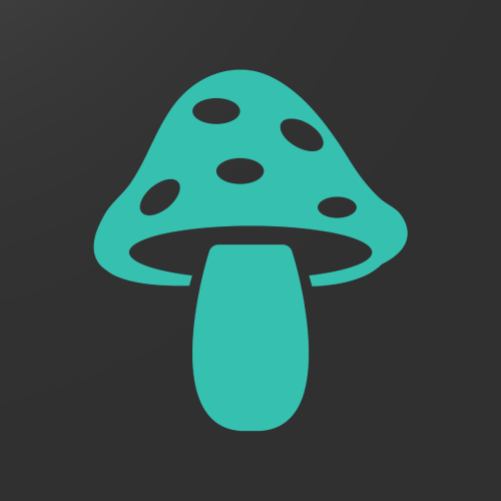

<p align="center" width="100%">
    
</p>

<h3 align="center">MycoTrack</h3>

  <p align="center">
    A Vue.js and Rails app for tracking mushroom samples.
    <br />
    <br />
    <a href="https://github.com/erayalkis/mycotrack_frontend/issues">Report Bug</a>
    ·
    <a href="https://github.com/erayalkis/mycotrack_frontend/issues">Request Feature</a>
  </p>

# About MycoTrack:

`MycoTrack` is a simple to use, efficient, and developer friendly app for tracking your mushroom samples.

## Features:

- Live statistics for your data.
- Fluid and responsive UI.

# Developers

## Installation

To install the latest release:

```
gem install gofile_ruby
```

## Usage

# License

Licensed under the [MIT License](https://github.com/erayalkis/gofile_ruby/blob/main/LICENSE)
